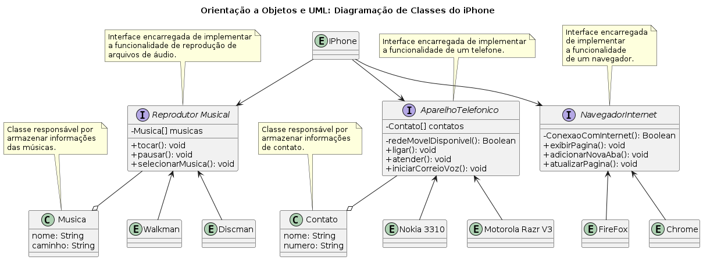

# Desafio interfaces

_Esse código deve implementar uma classe Iphone que tenha como interfaces de um navegador, aparelho telefonico e reprodutor musical._

_Desafio disponivel no repo [Diagramação De Classes Iphone](https://github.com/SilvioCavalcantiBonfim/Diagramacao-de-Classes-do-iPhone?tab=readme-ov-file)_

### Diagrama

---

### Descrição das Interfaces e Classes

#### Reprodutor Musical (MusicPlayer)
- A interface Music Player é responsável por implementar:
    - Reprodução de arquivos de áudio.
- Possui os métodos:
    - `play()`
    - `pause()`
    - `selectMusic()`
- A classe Music armazena informações sobre as músicas.

#### Aparelho Telefônico (Phone)
- A interface para Aparelho Telefônico é responsável por implementar os métodos de um Aparelho Celular:
    - `call()`
    - `pickUp()`
    - `newVoiceMessage()`
- A classe Contact armazena informações de contatos.

#### Navegador de Internet (BrowserNavigator)
- A interface Navegador de Internet é responsável por implementar um navegador web.
- Possui os métodos:
    - `displayPage()`
    - `addNewTab()`
    - `refreshPage()`

#### Entidades
Existem algumas entidades representadas no diagrama, como IPhone, FireFox, Chrome, Nokia 3310, Motorola Razr V3, Walkman e Discman, que representam diferentes dispositivos ou aplicativos que podem usar as interfaces e classes mencionadas acima.